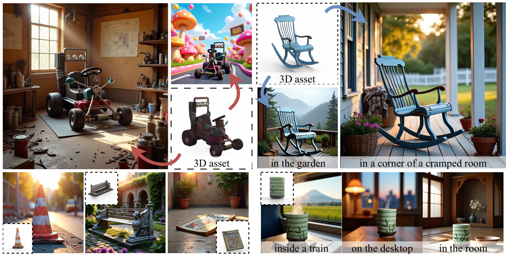

# RefAny3D: 3D Asset-Referenced Diffusion Models for Image Generation

<a href='https://judgementh.github.io/RefAny3D'></a> &nbsp;



## TODO List
- [ ] Inference code and pretrained models.
- [ ] Training code.
- [ ] Training dataset.

## Quickstart

### Create environment
1. Clone the repository and create conda environment: 
```
git clone https://github.com/JudgementH/RefAny3D.git
conda create -n r3d python=3.10
conda activate r3d
```
2. Requirements installation
```
pip install -r requirements.txt
```
